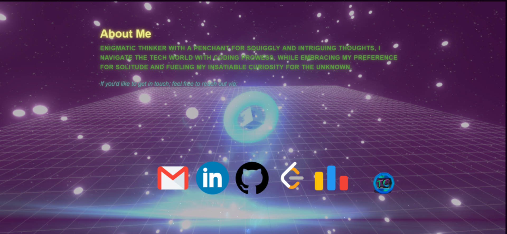

# Website with 3D User Interface

Welcome to the repository for a website featuring a captivating 3D user interface created using THREE.js. Follow the steps below to experience the immersive 3D UI locally:

## Screenshot:
    


## Installation Instructions

1. **Clone the Repository**: Clone this repository to your local machine using Git.

    ```bash
    git clone https://github.com/Turbocyb0rg/Website-THREE.js.git
    ```

2. **Navigate to the Project Directory**: Enter the project directory.

    ```bash
    cd Website-THREE.js
    ```

3. **Install Dependencies**: Install the necessary dependencies using npm.

    ```bash
    npm install
    ```

4. **Run the Development Server**: Start the local development server to view the website.

    ```bash
    npm run dev
    ```

5. **View the Website**: Open your web browser and navigate to [http://localhost:3000](http://localhost:3000) to explore the website with the captivating 3D UI.

## Additional Information

Feel free to explore the code and customize it to fit your requirements. Should you encounter any issues or have any questions, please don't hesitate to open an issue or reach out to me. Enjoy immersing yourself in the mesmerizing 3D user interface!
